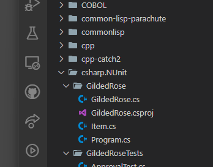

# Gilded Rose starting position in Unity C#
1. Install Unity version [2022.3.38f1](https://unity.com/releases/editor/whats-new/2022.3.38) into Unity Hub

2. Have Unity Hub open the 

	

- Spell out Unity version (2022.3.38f1, maybe even link)
- Show how to get to the test runner, edit mode tab
- Show how to make VS Code select the solution file
